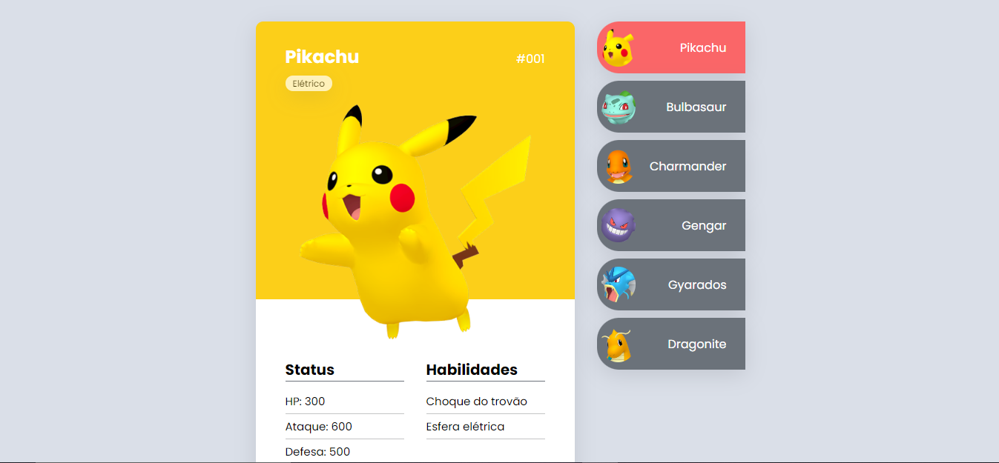

# Pokedex mapa dev week

  
  
  

 

Projeto desenvolvido durante a mapa dev week em 03/2022 , para o melhor entendimento das tecnologias bases do frontend

 - [Html](https://developer.mozilla.org/pt-BR/docs/Web/HTML)
 - [Css](https://developer.mozilla.org/pt-BR/docs/Web/CSS)
 - [javascript](https://developer.mozilla.org/pt-BR/docs/Web/JavaScript)

 

---

Desenvolvido Por [Alessandro Massarotti Jr](https://github.com/alessandro-massarotti-jr) 🤖
